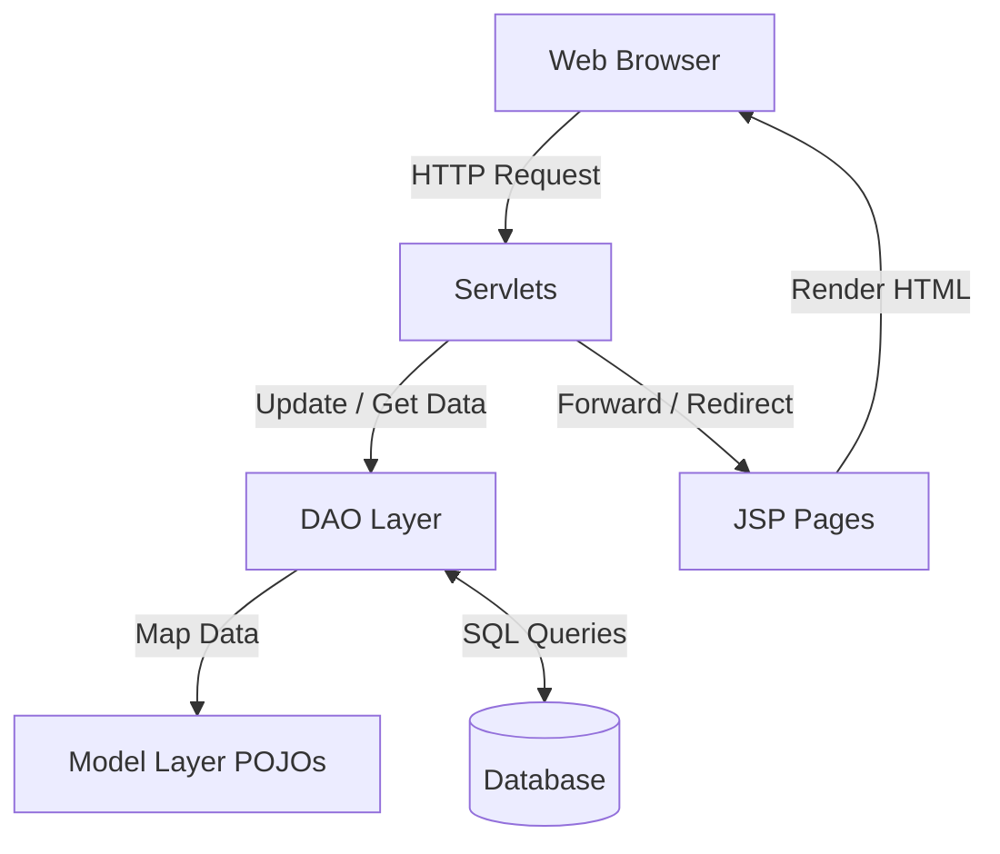
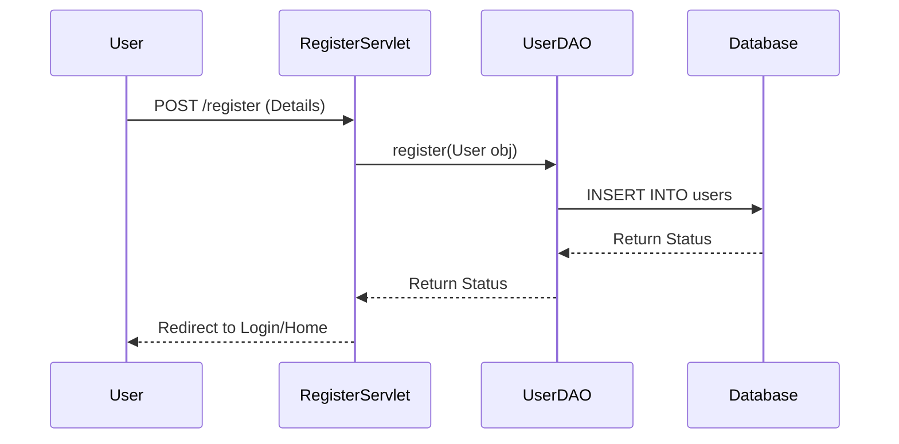
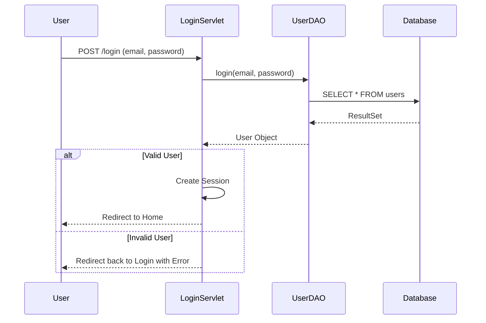
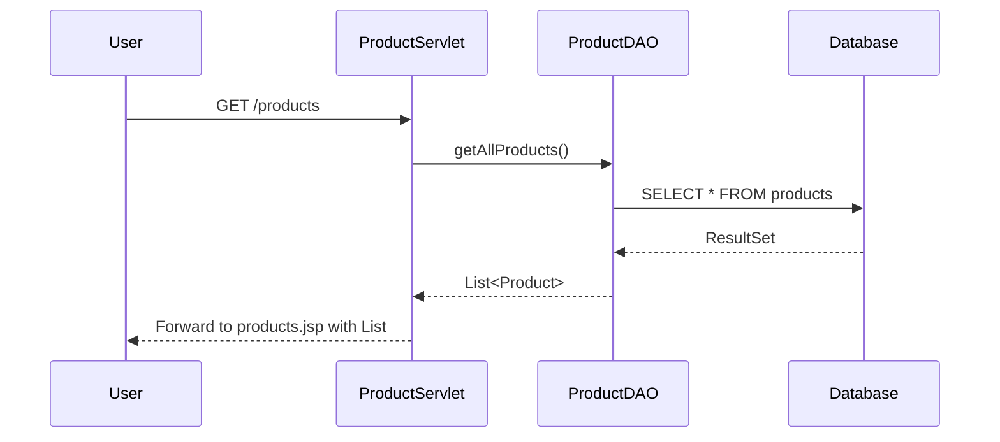
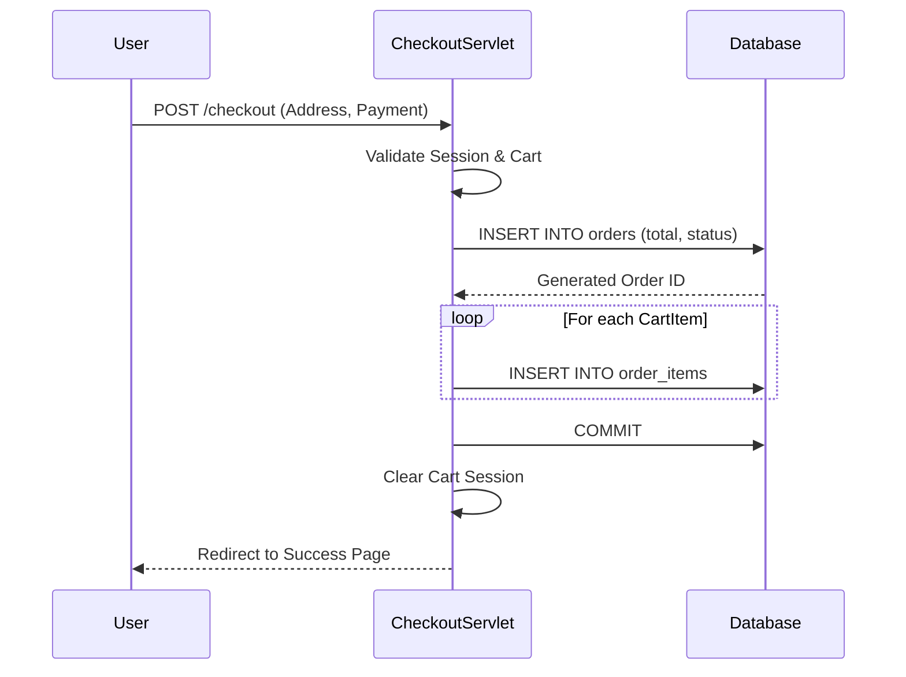

# Architecture and Sequence Diagrams

## MVC Architecture Overview

The application follows the Model-View-Controller (MVC) architectural pattern:

- **Model**: Java POJO classes representing the business entities (`User`, `Product`, `Order`, etc.) and Data Access Objects (DAOs) executing the logic to persist and retrieve data from the database.
- **View**: JSP (JavaServer Pages) files handle the presentation logic, displaying data to the users and sending requests to the Controllers. (Inferred based on standard Java EE structure)
- **Controller**: Java Servlets intercept HTTP requests from the views, invoke the appropriate DAOs for data operations, and dispatch the response back to the views.

---

## Sequence Diagrams

### 1. User Registration Flow

### 2. User Login Flow

### 3. Product Browsing Flow

### 4. Checkout Flow (Direct DB Access Example)

