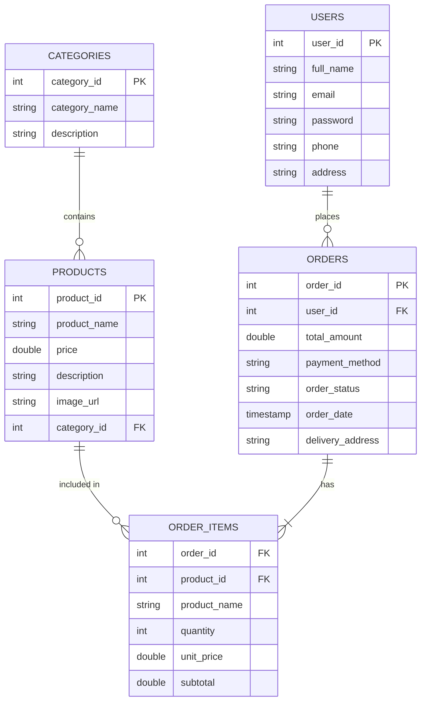

# Database Schema and Relationships

This document outlines the database structure, entity relationships, and how the Database tables map to the Java Model classes in the `com.ecommerce.model` package.

## Entity Relationship Diagram

---

## Models to Table Mapping

The table outlines the relational mapping between the Database Tables and the backend Java classes.

| Database Table | Java Model Class | Description |
|---|---|---|
| **users** | `User.java` | Stores user account information (credentials, contact info). |
| **categories** | `Category.java` | Categorization structure for organizing products. |
| **products** | `Product.java` | Inventory details including names, prices, descriptions, and category associations. |
| **orders** | `Order.java` & `OrderGroup.java` | Tracks user checkout transactions, timestamps, and order status. |
| **order_items** | `OrderItem.java` & `CartItem.java` | The junction table detailing which products belong to which order along with snapshot data (price, quantity). |

### Important Implementation Details
- **CartItem**: Exists largely as a temporary state object during a user session before an order is placed. Once checkout is completed, `CartItem` data is persisted into the `order_items` table.
- **OrderGroup**: Used in presentation logic (like viewing order history) to group an Order with a list of its corresponding `CartItems`.
